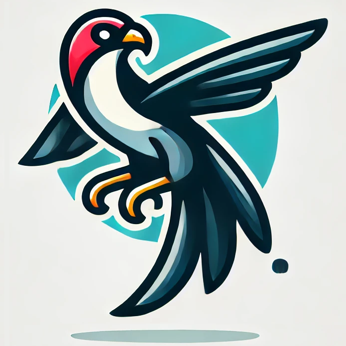

<div align="center">

<!-- <h1>JiuTian (九天) </h1> -->
<h2 class="papername">  FALCON: Resolving Visual Redundancy and Fragmentation in High-resolution Multimodal Large Language Models via Visual Registers</h2>
<div>
<div>
    <a href="https://scholar.google.com/citations?user=iMJYtvwAAAAJ" target="_blank">Renshan Zhang</a><sup>1</sup>,
    <a href="https://scholar.google.com/citations?user=9Vc--XsAAAAJ&hl=en&oi=ao" target="_blank">Rui Shao</a><sup>1</sup>†,
    <a href="https://scholar.google.com/citations?user=Mpg0w3cAAAAJ" target="_blank">Gongwei Chen</a><sup>1</sup>,
    <a href="https://faculty.hitsz.edu.cn/guanweili" target="_blank">Weili Guan</a><sup>1</sup>,
    <a href="https://openreview.net/profile?id=~Kaiwen_Zhou2" target="_blank">Kaiwen Zhou</a><sup>2</sup>,
    <a href="https://scholar.google.com/citations?hl=en&user=yywVMhUAAAAJ" target="_blank">Liqiang Nie</a><sup>1</sup>†
</div>

<sup>1</sup>Harbin Institute of Technology, Shenzhen<br>
<sup>2</sup>Huawei Noah's Ark Lab<br>
†Corresponding author


[](https://arxiv.org/abs/2501.16297)

</div>

</div>

## If you find this work useful for your research, please kindly cite our paper and star our repo.

## Updates
- [01/2025] [Arxiv paper](https://arxiv.org/abs/2501.16297) released.

## Introduction

This is the github repository of *FALCON: Resolving Visual Redundancy and Fragmentation in High-resolution Multimodal Large Language Models via Visual Registers*. In this work, we propose the FALCON model, which introduces a novel visual register technique to simultaneously address the issues of visual redundancy and fragmentation in the high-resolution visual encoding of MLLMs.

The framework of the proposed FALCON model:

<div align="center">

</div>

## :fire: Details will be released. Stay tuned.

## Citation

If you find this work useful for your research, please kindly cite our paper:

```
@misc{zhang2025falcon,
      title={FALCON: Resolving Visual Redundancy and Fragmentation in High-resolution Multimodal Large Language Models via Visual Registers}, 
      author={Renshan Zhang and Rui Shao and Gongwei Chen and Kaiwen Zhou and Weili Guan and Liqiang Nie},
      year={2025},
      eprint={2501.16297},
      archivePrefix={arXiv},
      primaryClass={cs.CV},
      url={https://arxiv.org/abs/2501.16297}, 
}
```